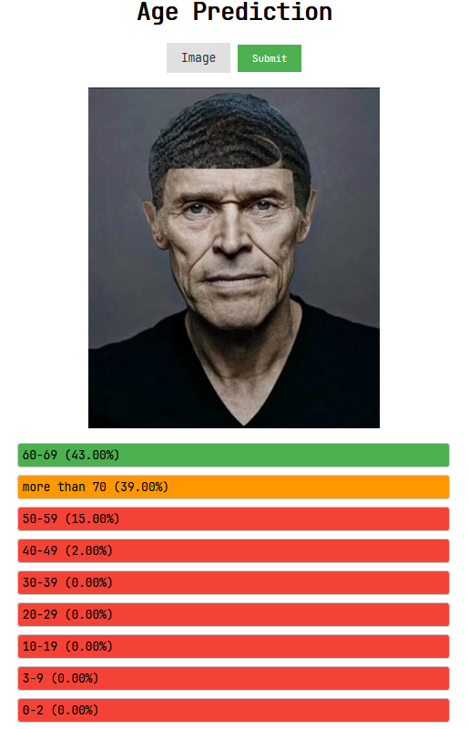

# Age Prediction

## Introduction

I have used this [Kaggle dataset](https://www.kaggle.com/frabbisw/facial-age) to create a model that can predict the age of a person from a photo of their face.

This data consists of thousands of photos of people's faces. Each photo has been labeled with the age of the person in the photo. The dataset is split into a training set and a test set. The training set and test set were used together to train the model. The model was then tested on the test set to see how well it could predict the age of people in the test set.

## Setup

1. Clone the repository

```bash
git clone https://github.com/Detopall/age-prediction.git
```

### Server Setup

1. Install the dependencies

```bash
cd age-prediction
cd server
pipenv install
```

2. Run the server

```bash
pipenv shell
python app.py
```

## Client Setup

```bash
cd age-prediction
cd client
```

You can now just run the index.html file in your browser or use a live server.
Usage

Press the Image button and choose a colored image that is of a persons face and click on the submit button. The result will be displayed above the image.

## Examples

**AGE PREDICTION EXAMPLE**



**AGE PREDICTION FAIL**


The reason this fails is because the image doesn't contain color. The model was trained on colored images and therefore it can't predict the age of a person from a black and white image.
